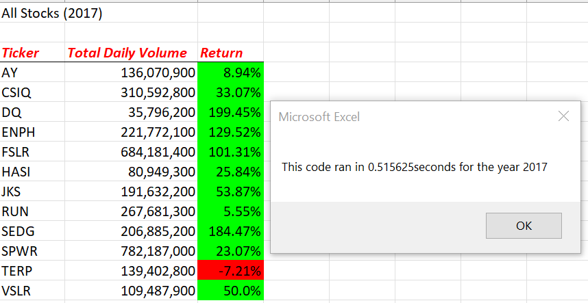
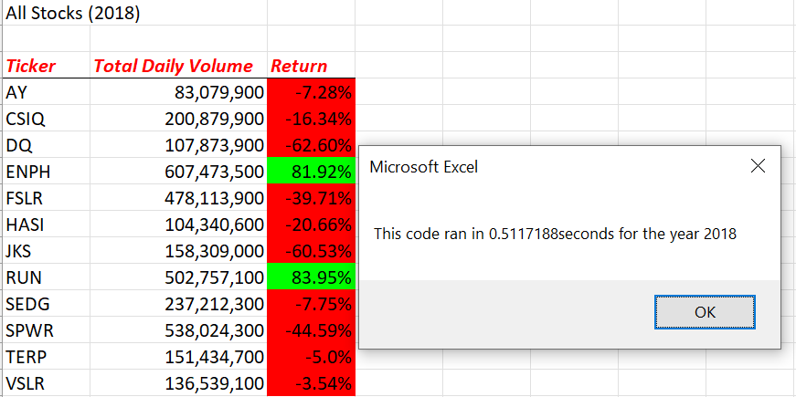

# Green_Stocks
## Project Overview
This project aims to analyse Green Stocks using VBA to help Steve choose the right stocks to invest his parent's money. They are passionate about green energy and they have decided to invest all their money into DAQO New Energy Corporation. Steve is not willing to invest all the money on one stock. We have created macros pre-programmed to show total volume and percentage of return on any given stock. We further refactor the code to be more efficient for larger datasets, so it won't take too long to run when Steve analyses " thousands of stocks".
## Results
### Original vs Refactored code  (2017)
 

### Original vs Refactored code  (2018)
 
-------
The refactored coding improved efficiency of macros run-time significantly. This was achieved by discarding intricate nested loops in the original code.

There are a few stocks in this category that have had pretty good returns, and they're both pretty widely traded. It might not be a bad idea for Steve to consider investing in a wider range of stocks in this category in case he finds something he likes.
## Summary
Refactoring is a process of making our code easier to read and understand, and it can also help improve its performance. Sometimes, we make small changes to the codebase that don’t introduce any new errors, and these changes can make the code slightly better. However, it’s important to be careful when we refactor the code if we don’t understand how much coverage the code has.
The original VBA script is simple and easy to understand. However, nested loops can take a long time to run, and in general, it's important to try to reduce the number of nested loops to increase performance. The refactored script uses arrays to collect the same information as the original script, which is faster and more efficient.
It seems that refactoring should always be on the mind of a good analyst and programmer in order to take smoother, more elegant, and ultimately more user-friendly approaches to completing necessary tasks. The larger community benefits from the continued refinement of solutions to problems which call for similar patterns. Getting the job done is the bare minimum of a coding task. Instead, the focus should be on automating processes that work better, but also ones that become more broadly useful to other settings.
